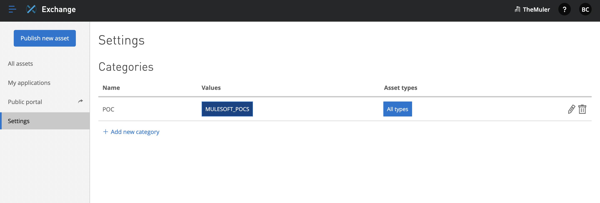

# Mulesoft Application Exchange publish

This is a demo on how to publish a mule application as an asset to MuleSoft Exchange along with Mutable data and documents.

### Publish Mule App as an asset

Steps:
- Change the groupId in pom.xml to Anypoint platform org id.

```xml
<groupId>${ORGANIZATION_ID}</groupId>
```
-   Add Classifier to specify the asset type in the mule maven plugin configuration tag as shown below

```xml
<plugin>
    <groupId>org.mule.tools.maven</groupId>
    <artifactId>mule-maven-plugin</artifactId>
    <version>${mule.maven.plugin.version}</version>
    <extensions>true</extensions>
    <configuration>
        <!-- This is required when publishing assets -->
        <classifier>mule-application</classifier> 
        <!-- To deploy, cloudhub deployment comes here -->
    </configuration>
</plugin>
```

-   Distribution Management should be added to the pom to publish the asset. Here the ORGANIZATION_ID is the id of the Anypoint Platform org id.

```xml
<distributionManagement>
    <repository>
      <id>Repository</id>
      <name>Corporate Repository</name>
      <url>https://maven.anypoint.mulesoft.com/api/v3/organizations/ORGANIZATION_ID/maven</url>
      <layout>default</layout>
    </repository>
  </distributionManagement>
```

-   Once this is added, the repo credentials should be configured in maven's ~/.m2/settings.xml

```xml
    <server>
      <id>Repository</id>
      <username>myusername</username>
      <password>mypassword</password>
    </server>
```

### Adding Mutable data

-   To add mutable data such as categories/tags, the following properties can be added as below

```xml
		<properties>
			<categories key="categoryKey">someValue</categories>
			<fields key="fieldKey">someValue</fields>
			<tags>tag1,tag2,tag3</tags>
		</properties>
```
- For these categories to work, they have to be configured in Exchange settings in Anypoint platform.




### Adding Documentation for asset

-   To add documentation, first in src/main/resources, create docs folder. Include each documentation page as a markdown files. The page order can be specified by having an optional config.json with pageOrder key as shown below. In the pageOrder array, specify the pages as a string in page order. example, [main.md](http://main.md) → main and [examples.md](http://examples.md) → examples. (["main","examples")

```json
{
	"pageOrder": ["main"]
}
```

-   For the maven to do the magic, add assembly plugin to the pom.xml and create docs-assembly in resources folder to hold assembly.xml

```xml
<plugin>
    <groupId>org.apache.maven.plugins</groupId>
    <artifactId>maven-assembly-plugin</artifactId>
    <version>2.6</version>
    <configuration>
        <appendAssemblyId>true</appendAssemblyId>
    </configuration>
    <executions>
        <execution>
            <id>create-distribution</id>
            <phase>package</phase>
            <goals>
                <goal>single</goal>
            </goals>
            <configuration>
                <descriptors>
			<!-- This tells maven where to look for assembly descriptor.-->
                    <descriptor>/src/main/resources/docs-assembly/assembly.xml</descriptor>
                </descriptors>
            </configuration>
        </execution>
    </executions>
</plugin>
```

-   assembly.xml can look like this

```xml
<?xml version="1.0" encoding="UTF-8"?>
<assembly xmlns="http://maven.apache.org/plugins/maven-assembly-plugin/assembly/1.1.3"
         xmlns:xsi="http://www.w3.org/2001/XMLSchema-instance"
         xsi:schemaLocation="http://maven.apache.org/plugins/maven-assembly-plugin/assembly/1.1.3 http://maven.apache.org/xsd/assembly-1.1.3.xsd">
   <id>docs</id> <!-- Specifying what we are trying to assemble -->
   <formats>
       <format>zip</format> <!-- Assemble to which format -->
   </formats>
   <includeBaseDirectory>false</includeBaseDirectory>
   <fileSets>
       <fileSet>
           <directory>${project.basedir}/src/main/resources/docs</directory> <!-- Location of markdown files -->
           <outputDirectory>/</outputDirectory> <!-- where to output the built zip -->
           <useDefaultExcludes>true</useDefaultExcludes>
       </fileSet>
   </fileSets>
</assembly>
```

-   Once the above settings are done, use maven to deploy to exchange.

```bash
mvn deploy
```

-   If you have some custom asset to deploy, tweak the pom.xml by adding maven exchange plugin as below (**OPTIONAL - ONLY FOR CUSTOM ASSETS**)

```xml
<plugin>
      <groupId>org.mule.tools.maven</groupId>
      <artifactId>exchange-mule-maven-plugin</artifactId>
      <version>0.0.13</version>
      <executions>
          <execution>
              <id>validate</id>
              <phase>validate</phase>
              <goals>
                  <goal>exchange-pre-deploy</goal> <!-- Validate before deploying to exchange-->
              </goals>
          </execution>
          <execution>
              <id>deploy</id>
              <phase>deploy</phase>
              <goals>
                  <goal>exchange-deploy</goal> <!-- Deploy goal to exchange -->
              </goals>
          </execution>
      </executions>
  </plugin>
```
